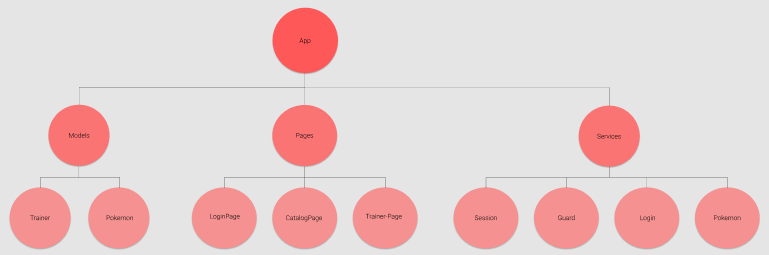

# PokemonTrainer

This application was created during Noroff's Accelerated program. It is an application for browsing and catching pokemon.

You can find the app [here]()

## API

We used a JSON server to store our data. You can find it [here](https://noroff-assignment-api-nanfrid.herokuapp.com/)

For the pokemon data the [Pokemon API](https://pokeapi.co/) was used.

## Login Page

The login page presents the user with a login form. If the user does not already exist they are registered in the API.
The logged in user gets stored in the browser session, and the user is sent to the pokemon catalogue page.

## Pokemon Catalogue

The pokemon catalogue page displays 20 pokemons at a time. The pokemons from the Pokemon API are stored in local storage. To collect a pokemon the user click on the card for the pokemon they want, and a check mark appears indicating
that the pokemon has been caught.

By clicking the next button another 20 pokemons are displayed and the user can go back 20 pokemon by using the back button.
By clicking the trainer page button the user is sent to the trainer page

## Trainer Page

The trainer page displays the logged in user's collected pokemons. Each pokemon card has a delete button to remove the collected pokemon.
By clicking the back button the user is taken to the pokemon catalogue page.
The logout button deletes the user from the session and redirects to the login page.

## Component Tree

## Running the app locally

Run `npm install` and then `ng serve` in the root folder. Navigate to `http://localhost:4200/`. The app will automatically reload if you change any of the source files.
